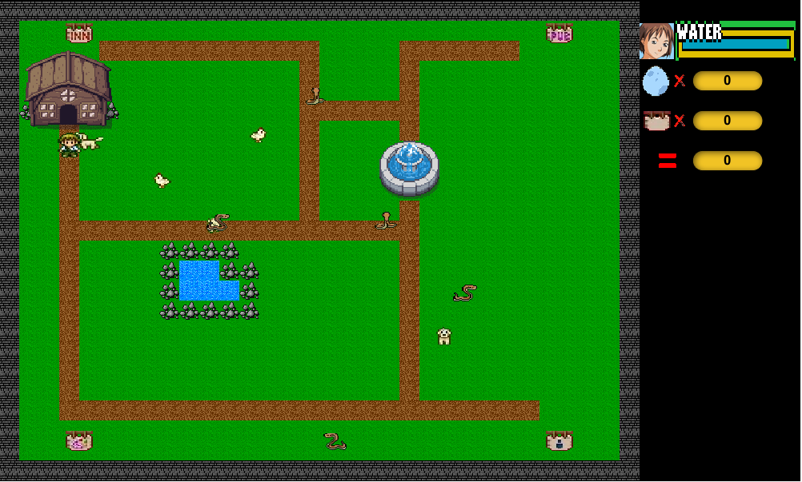

# 🌟 Καλωσήρθες στο **Yonko Game** 🌟

Ένα **συναρπαστικό παιχνίδι στρατηγικής και περιπέτειας**, όπου ο στόχος σου είναι να **συλλέξεις διάφορα αντικείμενα** και να τα **τοποθετήσεις στις σωστές θέσεις μέσα στο σπίτι**, ώστε να **φορτίσεις το Totem σου με ενέργεια** και να **νικήσεις**!

---

## 🖼️ Gameplay Screenshot

---

## 🔄 Κανόνες:

- Μπορείς να **μεταφέρεις ένα αντικείμενο κάθε φορά** στην τσάντα σου.
- **Έξω από το σπίτι** κυκλοφορούν **δηλητηριώδη φίδια** 🐍 που μειώνουν τη **Water (ζωή)** σου.
- **Κοτούλες** 🐔 γεννούν **αυγά** που μπορείς να φας για **έξτρα πόντους** – όμως **πρόσεχε τα σκυλάκια** 🐶, τα λατρεύουν κι αυτά!
- **Μέσα στο σπίτι** θα βρεις **ανταμοιβές (Food)** 🍖 που σου δίνουν ζωή, αλλά **μειώνονται** όσο φέρνεις αντικείμενα.
- Το παιχνίδι τελειώνει όταν:
  - ✅ Έχεις τοποθετήσει **όλα τα αντικείμενα στο σπίτι** → **ΝΙΚΗ** 🏆
  - ❌ Έχεις **μηδενίσει τη ζωή σου** → **ΗΤΤΑ** 💀

---

## 🏅 Πόντοι:

| Αντικείμενο      | Πόντοι     |
|------------------|------------|
| 🍳 Αυγό           | +3 πόντοι  |
| 📦 Αντικείμενο     | +10 πόντοι |
| ❤️ Υπόλοιπη ζωή   | Bonus πόντοι |

---

🎮 **Παίξε έξυπνα. Κινήσου γρήγορα. Και πρόσεχε τα φίδια!**  
👉 **Πάτησε ENTER για να ξεκινήσεις...**

---

### 💡 Για προγραμματιστές:
Αυτό το παιχνίδι δημιουργήθηκε με αγάπη για τον κόσμο της περιπέτειας και της φαντασίας. Αν θέλεις να συμβάλλεις ή να το βελτιώσεις, είσαι ευπρόσδεκτος/η!

---

### 📌 License
[MIT License](LICENSE)
